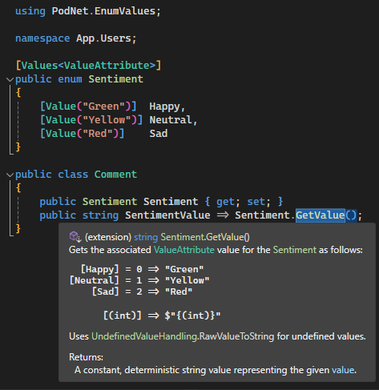
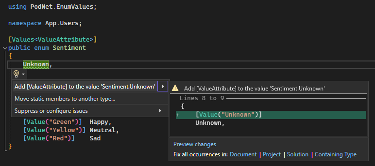
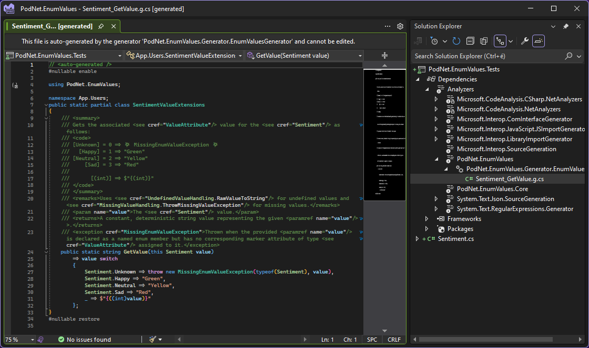

# PodNet.EnumValues [](https://www.nuget.org/packages/PodNet.EnumValues/)

A simple and powerful C# code generator that lets you define string values for your enums to implement 🔥🔥🔥 lookups. Greatly inspired by Andrew Lock's [NetEscapades.EnumGenerators](https://github.com/andrewlock/NetEscapades.EnumGenerators).

## Lookups 👆 for Your Enums!

Did you ever need to get down to the nitty-gritty of trying to extract a `DisplayAttribute`'s `Name` property for your enum values using reflection? It feels quite weird to reference `System.ComponentModel` objects in modern code, doesn't it? **No more!** 🛑 With `PodNet.EnumValues` you can simply create your enums as usual, and decorate the type with the provided `[Values<T>]`, the enum members with `[Value]` (or your own custom descendant of it), and you'll get magic extension methods that implement the lookup logic.

- [x] 🚀 Simple. 
- [x] 🆓 Free.
- [x] ⚙️ Configurable.
- [x] 🔥 Fast.
- [x] ✨ Awesome.

## Support and Features

- Supports your C# 11+ codebase (generic attribute support required)
- .NET Standard 2.0, .NET Core 2.0+, .NET Framework 4.6.1+, .NET 5+ [etc.](https://dotnet.microsoft.com/en-us/platform/dotnet-standard)
- Any IDE: Visual Studio, Rider or VS Code
	- ...or no IDE, because it works from the command line using `dotnet` CLI
- This is an efficient [incremental Roslyn source generator](https://github.com/dotnet/roslyn/blob/main/docs/features/incremental-generators.md)
- Supports [trimming](https://learn.microsoft.com/en-us/dotnet/core/deploying/trimming/trim-self-contained) for small file sizes
- Highly configurable code generation
- Immediate feedback on your generated methods with helpful auto-generated IntelliSense comments
- Supports enums with ⛳ `[Flags]` ⛳
- Great for simple (or complex) DIY localization scenarios, UI lookups for icons, colors, resources, cross-references, alternative keying, and lots more!

## Usage

1. Install the [NuGet package](https://www.nuget.org/packages/PodNet.EnumValues) to the project you want to use it in.
1. Define your enums like you would normally.
    ```c#
    public enum Sentiment
    {
        Happy,
        Neutral,
        Sad
    }
    ```
1. Add `[Values<ValueAttribute>]` to the enum **type** and decorate the enum **values** with `[Value]`:
    ```c#
    [Values<ValueAttribute>]
    public enum Sentiment
    {
        [Value("Green")]  Happy,
        [Value("Yellow")] Neutral,
        [Value("Red")]    Sad
    }
    ```
1. As the magic happens in the background as you type, an extension method will get generated — by default, in the same namespace as the enum type, so you don't need to add any additional `using`s —, which you can simply call using `enum.GetValue()`:
<br>

<br>
  There is interactive documentation generated for the methods as well. Parametrization of `[Values]` and changing the enum type's shape also changes the generated documentation accordingly (as well as the generated code, obviously).
1. You also get an analyzer and code fix if you miss a value:
  <br>
  
  <br>
  You can also configure this warning (or any other generated warnings) to appear as an error, or silence them individually or globally (although the latter is not recommended).

   > [!NOTE]
   > Unfortunately, it's not currently possible to offer a "rename" or "replace" functionality when generating code for string *literal* values, so you'll have to inspect and overwrite the generated name yourself (which defaults to the name of the enum member).

> [!IMPORTANT]
> Sometimes (mostly when doing file operations like renaming/moving files or directories, but rarely even when only editing the file contents), Visual Studio tends to not run the generator when typing, even though it should. The generator will run when executing *Build* or *Rebuild* in this case (or when it feels it's got enough time to in the background). This means you might not see the generated code, types, methods and reported diagnostics like warnings until you eventually build the project.
>
> You can also try restarting Visual Studio or unloading and then reloading the project.
>
> VS Code seems to have this issue more rarely than fat Visual Studio does.


> [!IMPORTANT]
> If you rename, move, delete or create some files/folders in Visual Studio, always check if VS did some unintended modifications to the `*.csproj` file, like modifying some of your `<AdditionalFiles>` `ItemGroup` elements.

You can also inspect (but not modify) the generated code by navigating to `{Project}/Dependencies/Analyzers/PodNet.EnumValues` in Visual Studio:
<br>

<br>

> For reference and your viewing pleasure, we'll supply the code here as well (implementation details might change across package versions):
>
> ```csharp
> // <auto-generated />
>#nullable enable
>
>using PodNet.EnumValues;
>
>namespace App.Users;
>public static partial class SentimentValueExtensions
>{
>    /// <summary>
>    /// Gets the associated <see cref="ValueAttribute"/> value for the <see cref="Sentiment"/> as follows:
>    /// <code>
>    /// [Unknown] = 0 => 💥 MissingEnumValueException 💥
>    ///   [Happy] = 1 => "Green"
>    /// [Neutral] = 2 => "Yellow"
>    ///     [Sad] = 3 => "Red"
>    ///
>    ///       [(int)] => (int).ToString()
>    /// </code>
>    /// </summary>
>    /// <remarks>Uses <see cref="UndefinedValueHandling.RawValueToString"/> for undefined values and <see cref="MissingValueHandling.ThrowMissingValueException"/> for missing values.</remarks>
>    /// <param name="value">The <see cref="Sentiment"/> value.</param>
>    /// <returns>A constant, deterministic string value representing the given <paramref name="value"/>.</returns>
>    /// <exception cref="MissingEnumValueException">Thrown when the provided <paramref name="value"/> is declared as a named enum member but has no corresponding marker attribute of type <see cref="ValueAttribute"/> assigned to it.</exception>
>    public static string GetValue(this Sentiment value)
>        => value switch
>        {
>            Sentiment.Unknown => throw new MissingEnumValueException(typeof(Sentiment), value),
>            Sentiment.Happy => "Green",
>            Sentiment.Neutral => "Yellow",
>            Sentiment.Sad => "Red",
>            _ => ((int)value).ToString()
>        };
>}
>#nullable restore
>
> ```
>
> [!NOTE] The generated code now also accounts for the `Unknown` value throwing a `MissingValueException`, and this is also reflected in the generated documentation. This is the case when you miss annotating a value with is corresponding `ValueAttribute` (or descendant, see below), and don't configure the `ValuesAttribute` further (see below as well).

## Advanced Examples

You can see that the generator's basic functions are as easy as pie to use.

However, there are some advanced scenarios as well.

### Supplying Your Own `ValueAttribute` to Customize the Extension Name

You can simply derive from `ValueAttribute` similarly to:

```c#
public class ColorAttribute(string value) : ValueAttribute(value);
```

> [!IMPORTANT]
> It's a requirement for your custom descendant to have its first constructor argument be the `string` value (but it can also be a referenced constant, not just inline). No other requirements, so you can supply more arguments if it suits your needs.

> [!NOTE]
> If you're on C# 11.0, single declarations using primary constructors and bodyless types are unavailable, so you have to declare the attribute like so:
> ```c#
> public class ColorAttribute : ValueAttribute
> {
>     public ColorAttribute(string value) : base(value) { }
> }
> ```

> [!NOTE]
> C# is awesome.

Then, apply your own derived `ValueAttribute` as the type parameter to `[Values<T>]`:

```c#    
[Values<ColorAttribute>] // 👈 "ColorAttribute" instead of "ValueAttribute"
public enum Sentiment
{
    [Color("Green")]  Happy,   // 👈 \
    [Color("Yellow")] Neutral, // 👈  | [Color] instead of [Value]
    [Color("Red")]    Sad      // 👈 /
}

public static void PrintSentiment(Sentiment sentiment)
    => Console.WriteLine(sentiment.GetColor()); // 🙌 "GetColor()" instead of "GetValue()"
```

### Define multiple lookups

You can simply provide multiple attributes (and configure each separately) to generate multiple lookups for a single enum type.

```c#
public class SpanishAttribute(string value) : ValueAttribute(value);
public class FrenchAttribute(string value) : ValueAttribute(value);

// Supply both 👇 "SpanishAttribute" and 👇 "FrenchAttribute" to the type
[Values<SpanishAttribute>, Values<FrenchAttribute>]

/*
  You could use multiple attribute lists as well, naturally:
  [Values<SpanishAttribute>]
  [Values<FrenchAttribute>]
  Also note that you can configure all instances differently
*/
public enum Greeting
{
    // 👇 Supply both translations 👇 to each value
    [Spanish("Hola"),          French("Salut")]   Hi,
    [Spanish("Buenos días"),   French("Bonjour")] GoodMorning,
    [Spanish("Buenas noches"), French("Bonsoir")] GoodEvening
}

Console.WriteLine($"| English (raw name) | Spanish | French | {Environment.NewLine} | --- | --- | --- |");
foreach (var greeting in Greeting.GetValues<Greeting>())
{
    Console.WriteLine($"| {greeting} | {greeting.GetSpanish()} | {greeting.GetFrench()}");
}
```

> The above renders the following markdown table:
> 
> | English (raw name) | Spanish | French |
> | --- | --- | --- |
> | Hi | Hola | Salut |
> | GoodMorning | Buenos días | Bonjour |
> | GoodEvening | Buenas noches | Bonsoir |


### Parameterizing `[Values]`

Using the previous method, you can simply customize the **name of the extension method generated**, and clarify the intent of the lookup by configuring its generated method name. However, you can also supply any other name for the method, and have other options as well. You have to configure ⚙️ the `[Values]` to do so.

The `[Values<T>]` you can apply to enum **types** works out of the box as is with sensible defaults. You can override them if you wish as described in this section. The descriptions below are also available via the in-IDE IntelliSense.

|`[Values]` Parameter|Description|
|---|---|
|**`string? Namespace`**|Namespace of the generated extension class. Default is to use the enum type's containing namespace.|
|**`Accessibility Accessibility`**|Accessibility/visibility of the generated extension class and method. Default is to inherit the enum type's accessibility. If you reuse the same class for the generated extensions, the accessibilities have to match.|
|**`string? ClassName`**|The extension class name. Default is `"{EnumTypeName}ValueExtensions"`.|
|**`string? MethodName`**|The name of the generated extension method. Leave null for the default, which is `"Get{Attribute}"` (translates to `"GetValue"` if `TValue` is `ValueAttribute`). You can reuse the same partial class for different enum types (even with the same namespace, class, and method names), as they are overloadable if the enum types differ.|
|**`UndefinedValueHandling UndefinedValueHandling`**|Defines what should happen when an undefined enum value is encountered (often resulting from unsanitized/invalid user input or an invalid cast from a raw value). Not to be confused with `MissingValueHandling`, which handles values that are defined, but have no associated `ValueAttribute`. The default is `UndefinedValueHandling.RawValueToString`.
|**`MissingValueHandling MissingValueHandling`**|Defines the behavior that is executed when a defined enum value has no associated `ValueAttribute` defined to it. The default is `MissingValueHandling.ThrowMissingValueException`, which also enables an analyzer that warns if an enum member hasn't defined the corresponding value with a `TValue` typed attribute.

<details>

<summary><code>Accessibility</code> values</summary>

Describes the possible accessibility level of the type.

> Values are the same as defined in the type `Microsoft.CodeAnalysis.Accessibility` (only the C# aliases).
> The only allowed values for an extension method are `internal` and `public`, as they need to be `static`, so defining inheritance behavior is not possible.

|`Accessibility`|
|---|
|`Internal = 4`|
|`Public = 6`|

</details>

<details>

<summary><code>UndefinedValueHandling</code> values</summary>

Defines what should happen when an undefined enum value is encountered (often resulting from unsanitized/invalid user input or an invalid cast from a raw value). Not to be confused with `MissingValueHandling`, which handles values that are defined, but have no associated `ValueAttribute`.

|`UndefinedValueHandling`|Description|
|---|---|
|`RawValueToString`|The raw value itself is returned by calling `object.ToString` on the value.|
|`EmptyString`|Returns an empty string. This is useful if you want to implement a wrapper around the generated method and handle this case in user code.|
|`ThrowMissingValueException`|Throws a `MissingEnumValueException`.|

</details>

<details>

<summary><code>MissingValueHandling</code> values</summary>

Defines the behavior that is executed when a defined enum value has no associated `ValueAttribute` defined to it.

|`MissingValueHandling`|Description|
|---|---|
|`ThrowMissingValueException`|Throws a `MissingEnumValueException` if the enum value (or flag) has no value defined to it. This also enables an analyzer that warns if a defined enum value on the type has no corresponding annotation.|
|`ToString`|Returns the enum name as a string. Does not actually call `object.ToString()`, but rather returns the name as a constant string instance directly, which is faster.|
|`PascalCasing`|Returns the enum name as a `PascalCasedString` by swapping the first character to be uppercased.|
|`CamelCasing`|Returns the enum name as a `camelCasedString`. Assumes the name is in PascalCase.|
|`KebabCasing`|Returns the enum name as a `kebab-cased-string`. Assumes the name is in PascalCase.|
|`SnakeCasing`|Returns the enum name as a `snake_cased_string`. Assumes the name is in PascalCase.|
|`RawValueToString`|The raw constant value itself is returned by calling `object.ToString()` on the value.|
|`EmptyString`|Returns an empty string. This is useful if you want to implement a wrapper around the generated method and handle this case in user code.|

</details>


Additional arguments are provided to configure the `[Flags]` behavior.

|`[Values]` Parameter|Description|
|---|---|
|**IsFlags**|Describes if the decorated enum type represents flag (binary) values. The generator defaults to true if `[FlagsAttribute]` is also present on the type declaration. <br> When this evaluates to true, `MissingValueHandling` only takes into account values with a power of two and the 0 value, and `UndefinedValueHandling` pertains only to flag values that are larger than possible to represent using the given value (so, greater than or equal to twice the defined largest binary enum flag value).<br>When using flags, a single value of the enum will be represented in binary, and all binary (power of two) values where a given value evaluates to having the given flag set will be concatenated by the generator.|
|**FlagsSeparator**|Override the default separator when getting the flag values of the type if **IsFlags** evaluates to true (being set manually or by the enum type having a `[FlagsAttribute]`); ignored otherwise. The default is `" | "`. You can supply a different separator individually when invoking the generated method.|

You can also apply multiple `[Values<T>]` instances to the same enum type, but the configurations have to be different (a sensible idea is to have different type parameters supplied).

Let's see an example.

```c#
namespace App.Comments;

[Values<ColorAttribute>]                    // 👈 All defaults
[Values<EmojiAttribute>(                    // 👈 All parameters are optional
    Accessibility = Accessibility.Internal, // 👈 Defaults to the enum's visibility, but can be public or internal
    Namespace = "App.Helpers",              // 👈 Defaults to the enum's namespace (would be "App.Comments" here), overriding this implies you'll need to import the namespace yourself at the usage sites
    ClassName = "EmojiExtensions",          // 👈 The default is "{EnumName}ValueExtensions"
    MethodName = "GetEmojiForSentiment",    // 👈 The default is "Get{TValue}", in this case would be "GetEmoji"
    MissingValueHandling = MissingValueHandling.EmptyString, // 👈 Default is to throw when you forget to add [Emoji] to a member (also warns if a value is missing when this is set to throw)
    UndefinedValueHandling = UndefinedValueHandling.ThrowMissingValueException // 👈 Default is "RawValueToString", which would return the raw int value if it wasn't Happy (0), Neutral (1) or Sad (2)
)]
public enum Sentiment
{
    [Emoji("😄"), Color("Green")]  Happy,
    [Emoji("🙄"), Color("Yellow")] Neutral,
    [Emoji("😔"), Color("Red")]    Sad
}

public static void PrintSentiment(Sentiment sentiment)
    => Console.WriteLine($"{sentiment.GetColor()} - {sentiment.GetEmojiForSentiment()}");

PrintSentiment(Sentiment.Happy);            // "Green - 😄"
```

### ⛳ Flags ⛳ support

And finally, you can also use this with enums that are used as [binary (bit) flags](https://learn.microsoft.com/en-us/dotnet/csharp/language-reference/builtin-types/enum#enumeration-types-as-bit-flags).

You'll get a warning if you miss a binary flag value (a power of two or the 0 value).

You can supply any non-flag value an override. You can do this for performance (if you have some common combinations), custom overrides, or special negative values (which throw an `ArgumentOutOfRangeException` otherwise).

```c#
[Flags] // 👈 Either add the [Flags]...
[Values<ValueAttribute>(
    IsFlags = true, // ...or set IsFlags = true
    FlagsSeparator = "" // The default is " | ", which represents a binary OR operation (the default in .NET's default Enum.ToString() as well).
)]
public enum Permissions
{
    [Value("!")]  Invalid = -1,                   // 👈 You *can* supply any non-flag values, even negative values, as normal. Undefined negative values will throw an ArgumentOutOfRangeException, however.
    [Value("-")]  None = 0,
    [Value("R")]  Read = 1,
    [Value("W")]  Write = 2,
                  ReadWrite = Read | Write,       // 👈 You don't need to supply the value if you use shorthands...
    [Value("X")]  Execute = 4,
    [Value("RX")] ReadExecute = Read | Execute,   // 👈 ...but you CAN, if you want. The provided value is only used if you don't supply your own separator.
                  WriteExecute = Write | Execute, // 👈 You don't have to define all possible flag combinations, but it's shown here for completeness.
    [Value("A")]  All = Read | Write | Execute    // 👈 You can override the output with any custom values you like.
}

public static class PermissionPrinter
{
    public static void PrintFlags(Permissions permissions)
    {
        Console.WriteLine(permissions.GetValue());
        Console.WriteLine(permissions.GetValue("|")); // You can individually override the default separator (which would be " - ", but we've already overridden it in the [Values<>] configuration for Permissions
    }

    public static void PrintSome()
    {
        PrintFlags(Permissions.ReadWrite); // 👈 Same as `(Permissions)3` or `Permissions.Read | Permissions.Write`
        // 👆 prints:
        // RW         // 👈 Iterates through all binary flags: 1 (Read = R) and 2 (Write = W), and concatenates them using the configured empty ("") FlagsSeparator
        // R|W        // 👈 GetValue("|") iterates and joins the values with the provided separator instead

        PrintFlags(Permissions.Read | Permissions.Write | Permissions.Execute); // Same as "(Permissions)7" or "Permissions.All"
        // 👆 prints:
        // A          // 👈 Get the ValueAttribute's value directly, if it is defined.
        // R|W|X      // 👈 GetValue("|") iterates and joins the values with the provided separator, and ignores the [Value("A")] value.

        PrintFlags((Permissions)15); // 👈 This contains Read (1) | Write (2) | Execute (4) and an undefined 8
        // 👆 prints:
        // RWX8       // 👈 If you want to disallow this behavior, you can set UndefinedValueHandling to ThrowMissingValueException or EmptyString.
        // R|W|X|8
    }
}
```

> [!TIP]
> Because the logic for enumerating the flag values is generated, you can go to the implementation (<kbd>F12</kbd>) and take a look yourself!

## Warnings and Code Fixes

|Code|Description|Notes|Fix|
|----|-----------|-----|---|
|PN1601|Value attribute is missing for enum value|Produced when you don't specify a `MissingValueHandling` other than the default `ThrowMissingValueException` AND an enum value has no corresponding `[Value]` assigned to it. If `IsFlags` is true, only takes into account possible single bit flag values (the None (0) value and positive powers of 2).|**Code fix**: adds the indicated `[Value]` attribute to the enum value. Please note that it is currently not possible to set the caret's position to the string literal value that is auto-generated, nor is it possible to "refactor" that literal (literals cannot be refactored, as they are constant values). You'll have to manually edit the generated `[Value("MyEnumName")]` yourself after applying the fix.<br><br>You can add the indicated attribute to the indicated value manually, remove the enum member, or change `MissingValueHandling` to any other value than the default `ThrowMissingValueException`, which will calculate the value based on the member's name.|
|PN1602|Enum types declared in generic types are not supported|Known limitation, see below.|**Code fix**: removes all `[Values<>]` attributes from the indicated enum *type* (but not the `[Value]` attributes from the members), thus preventing the generator to run at all.<br><br>You can also move the enum type to a desired location outside the generic structure.|
|PN1603|Enum members with aliases can lead to unexpected results|The enum type declares aliases for some raw values. In `enum MyEnum { V1, V2 = 0, V3 = V2 }`, all 3 members are mapped to the raw `0` value. This leads to unexpected results if trying to look up the value `0`. Thus, this scenario is not supported. Also note that having shorthands for flags won't be a problem if they are not redundant.|Remove the redundant declarations to that at most one is left for each underlying value.|
|PN1604|Undefined enum member for flag|If `IsFlags` is true (either by configuration or by having `[Flags]` on the enum type), and there are binary values missing that would need to be present to represent the **largest declared** enum member in the type, this warning is produced.|Check if the **largest declared** enum member's value is declared correctly and correct as needed. If it is correct, check that all binary flag values needed to represent the largest declared value are correctly declared as well. The missing numeral values are indicated in the warning messages produced.|

## Known Limitations

This project aims to make it clean to define lookups for enum values. There are some known limitations, however, that are good to know about.

- No support for `System.ComponentModel.DisplayNameAttribute`, `System.ComponentModel.DataAnnotations.DisplayAttribute`, or similar built-in or satellite attributes. This is intentional. The current implementation would blow up in size and complexity if we were to support multiple attribute types with varying semantics. However, if you think there should be some kind of additional support for this, we're all ears [[Discussions](https://github.com/podNET-Hungary/PodNet.EnumValues/discussions)].
  - There are other alternatives that target similar scenarios, including the awesome [NetEscapades.EnumGenerators](https://github.com/andrewlock/NetEscapades.EnumGenerators) by the brilliant [Andrew Lock](https://andrewlock.net/). You should take a look at that package anyways!
- Enum types nested in generic class structures (for example, `MyNamespace.MyClass<T>.MyEnum`) are not supported (and produce the warning `PN1602: Enum types declared in generic types are not supported`). It is possible to support this scenario, so let us know if you really want this implemented. Even better, send a pull request if you have it in you! :) The thing about this is that the generic type constraints have to be copied to the extension method declaration, which is quite cumbersome and finicky to implement. If you encounter this issue, it's recommended to move the enum type out of the generic structure, if possible. You can create a holder type with no type arguments, or just move it to the containing namespace or up the class hiererachy until no types are left.
- If you reuse generated partial classes (override the `Namespace` and/or `ClassName` pairs to match in multiple declarations) for whatever reason, you have to match the provided `Accessibility` values, as it is not possible to locate all partial declarations inside the generator. You'll get a compiler error `CS0262: Partial declarations of '{YourExtensionClass}' have conflicting accessibility modifiers` if this is the case.
- The value can only be a `string` value at the moment. Integral values are inherently supported by the enum types themselves (although not multiple values), and I saw no other viable scenarios that suggest other values (as `Attribute`s, these are constrained to a few constant types anyways) should be reasonable. Although it would be possible to supply another variant of the generator that generates the values using inversion of control (you could supply your custom class that takes the given enum type as a type parameter), it's not immediately obvious what purpose this would serve. If you want a similar feature, feel free to jump into the [[Discussions](https://github.com/podNET-Hungary/PodNet.EnumValues/discussions)].

## Troubleshooting

### My project cannot see the `[ValuesAttribute]` type, what's up?

Check if your `PackageReference` is correct in the `csproj` file. If you set the `PackageReference` manually to exclude (or don't include) the `compile` asset, the project you want to use the generator in won't see the assembly containing the attributes and enumerations you need to use the generator. It just won't fire up, because it's looking for the attribute on enum types.

The following are CORRECT references after installation:
```xml
<PackageReference Include="PodNet.EnumValues" Version="1.0.1" 
    PrivateAssets="all" />
<!-- This 👆 adds the generator and diagnostic analyzers, including the compile-time reference as a private dependency. It means you can use the generator from the consuming project, but not from any project referencing your project. This is recommended for building NuGet packages others will consume. -->

<PackageReference Include="PodNet.EnumValues" Version="1.0.1" />
<!-- NOT setting it to PrivateAssets="all" will allow the consumers of your project to transitively access the functionality of the generator. This means that if you install the package in project A, then reference A from B, both of your projects will be able to use the generator and see the compile-time attributes. This is recommended for building apps. -->
```

> [!NOTE]
> In version 1.0.0, the NuGet package was set up as a [`DevelopmentDependency`](https://github.com/NuGet/Home/wiki/DevelopmentDependency-support-for-PackageReference) (as it should for analyzer packages), but this resulted in the compile-time assemblies not being correctly referenced. If you managed to somehow install 1.0.0 of the package, please upgrade to 1.0.1 to see the required attributes.

## Contributing and Support

This project is intended to be widely usable, but no warranties are provided. If you want to contact us, feel free to do so in the org's [[Discussions](https://github.com/podNET-Hungary/discussions)] or the project's [topic](https://github.com/orgs/podNET-Hungary/discussions/1), at our website at [podnet.hu](https://podnet.hu), or find us anywhere from [LinkedIn](https://www.linkedin.com/company/podnet-hungary/) to [Meetup](https://www.meetup.com/budapest-net-meetup/), [YouTube](https://www.youtube.com/@podNET) or [X](https://twitter.com/podNET_Hungary).

Any kinds of contributions from issues to PRs and open discussions are welcome!

Don't forget to give us a ⭐ if you like this repo (it's free to give kudos!) or share it on socials!

## Sponsorship

If you're using our work or like what you see, consider supporting us. Every bit counts. 🙏 [See here for more info.](https://github.com/podNET-Hungary/PodNet.NuGet.Core/blob/main/src/PodNet.NuGet.Core/build/SPONSORS.md)